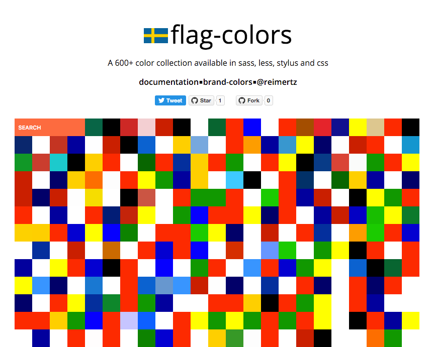

flag-colors is a collection of colors works available in sass, less, stylus and css

##Installation

```
npm install flag-colors
bower install flag-colors
```

##Usage

####scss
```scss
@import 'bower_components/flag-colors/dist/latest/scss/flag-colors.latest.scss'

.a-div {
  color: $sweden;
}
```
####less
```css
@import 'bower_components/flag-colors/dist/latest/less/flag-colors.latest.less'

.a-div {
  color: @sweden;
}
```
####sass
```sass
@import 'bower_components/flag-colors/dist/latest/scss/flag-colors.latest.sass'

.a-div
  color: $sweden
```
####stylus
```css
@import 'bower_components/flag-colors/dist/latest/stylus/flag-colors.latest.styl'

.a-div {
  color: $sweden;
}
```
####css

```html
  <link rel="stylesheet" href="bower_components/flag-colors/dist/latest/css/flag-colors.latest.min.css">`

  <span class="fc-sweden">This text is sweden-blue</span>
  <div class="fc-sweden-bg">This div has a sweden-blue background</div>
```

###Run flag-colors.com locally
If you want to work on the static homepage, just run the following commands
and you will get a live-reloading server listening for changes in /app
and flagColors.js
```bash
npm install
gulp dev
```
###Flags
[Full list of colors](https://github.com/reimertz/flag-colors/blob/master/data/flagColors.json)

---
> [reimertz.co](http://reimertz.co) &nbsp;&middot;&nbsp;
> GitHub [@reimertz](https://github.com/reimertz) &nbsp;&middot;&nbsp;
> Twitter [@reimertz](https://twitter.com/reimertz)
